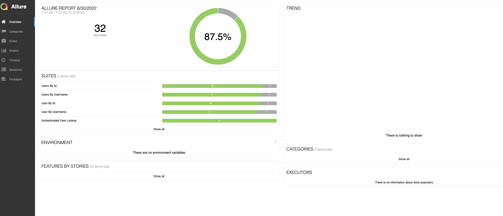

# Introduction

This project demonstrates how to use CodeceptJS with REST helper. These test cases primarily focuses on 5 GET Endpoints of the Twitter User Lookup API.

## How to use

This is done using CodeceptJS [https://codecept.io/](https://codecept.io/)

### Tech

This test uses a number of open source projects to work properly:

*[https://nodejs.org/en/](https://nodejs.org/en/) - evented I/O for the backend
*[https://codecept.io/](https://codecept.io/) - CodeceptJS
*[https://api.twitter.com/2/users/](https://api.twitter.com/2/users/) - Endpoints that are used in this project

### Installation

This requires [Node.js](https://nodejs.org/) v11+ to run.

Install the dependencies and devDependencies.

```sh
cd twitter-api-tests
npm i
```

### How to trigger API tests

To run all api tests just simply type

```sh
npm test
```

Example output

```sh
// Parallel execution tests
Running tests in 10 workers...

[01]   ✔ Invalid token in 303ms
[03]   ✔ Invalid token in 278ms
[02]   ✔ Unsupported Authentication in 399ms
[08]   ✔ Unsupported query string in 303ms
[04]   ✔ Invalid user id in 316ms
[06]   ✔ User found - Default payload in 318ms
[10]   ✔ Invalid token in 238ms
[05]   ✔ User not found in 256ms
[09]   ✔ Invalid user ids in 246ms
[07]   ✔ User found - with query string in 255ms
[01]   ✔ Username not found in 254ms
[06]   ✔ Invalid token in 221ms
[03]   ✔ User found - with query string in 253ms
[04]   ✔ Unsupported query string in 232ms
[08]   ✔ Multiple user ids with one not found in 240ms
[02]   ✔ User found - Default payload in 259ms
[05]   ✔ Invalid token in 224ms
[10]   ✔ More than 100 user ids in 248ms
[09]   ✔ More than 100 usernames in 236ms
[07]   ✔ Not found user ids in 231ms
[03]   ✔ Unsupported query string in 240ms
[06]   ✔ Username not found in 259ms
[01]   ✔ Users found - Default payload in 257ms
[10]   ✔ Some usernames not found in 249ms
[08]   ✔ User found - with query string in 285ms
[02]   ✔ Users found - with query string in 293ms
[07]   ✔ User found - Default payload in 253ms
[01]   ✔ Unsupported query string in 236ms

  OK  | 28 passed, 4 skipped   // 8s
```

To debug a test, just adding .only to the desired scenario, then run
```sh
npx codeceptjs run --verbose
```

Example output

```sh
Helpers: REST, JSONResponse
Plugins: screenshotOnFail, allure

User By Id --
    [1]  Starting recording promises
    Timeouts: 
  User found - with user.fields
    I send get request "/users/2244994945?user.fields=created_at,description,entities,id,location,name,profile_image_url,protected,url,username&expansions=pinned_tweet_id"
    › [Request] {"baseURL":"https://api.twitter.com/2/users/2244994945?user.fields=created_at,description,entities,id,location,name,profile_image_url,protected,url,username&expansions=pinned_tweet_id","headers":{"Authorization":"Bearer ****"}}
    › [Response] {"data":{"protected":false,"description":"The voice of the #TwitterDev team and your official source for updates, news, and events, related to the #TwitterAPI.","entities":{"url":{"urls":[{"start":0,"end":23,"url":"https://t.co/3ZX3TNiZCY","expanded_url":"https://developer.twitter.com/en/community","display_url":"developer.twitter.com/en/community"}]},"description":{"hashtags":[{"start":17,"end":28,"tag":"TwitterDev"},{"start":105,"end":116,"tag":"TwitterAPI"}]}},"url":"https://t.co/3ZX3TNiZCY","name":"Twitter Dev","username":"TwitterDev","profile_image_url":"https://pbs.twimg.com/profile_images/1445764922474827784/W2zEPN7U_normal.jpg","id":"2244994945","created_at":"2013-12-14T04:35:55.000Z","location":"127.0.0.1"}}
    I see response code is successful 
  ✔ OK in 308ms


  OK  | 1 passed   // 320ms

```
### Reports

After the tests ran, reports are generated, it could be rendered on CI/CD for instance Gitlab.


